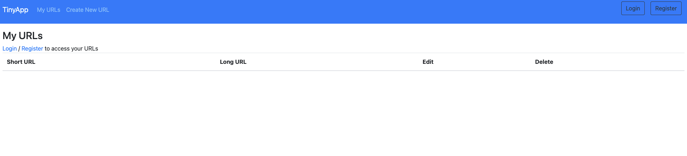
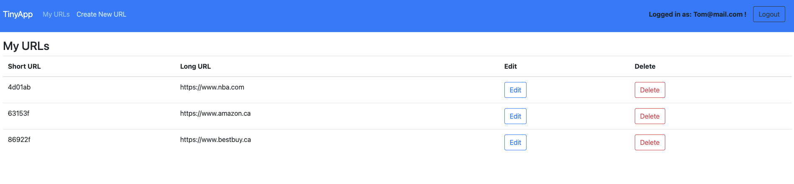
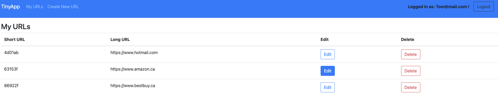
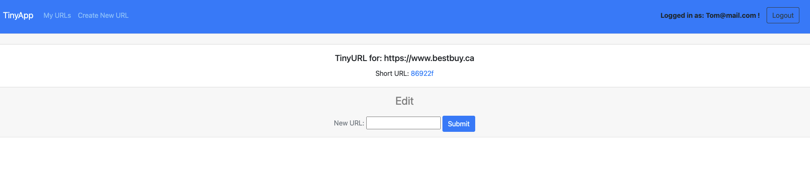
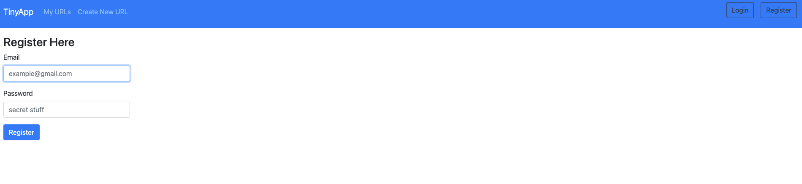
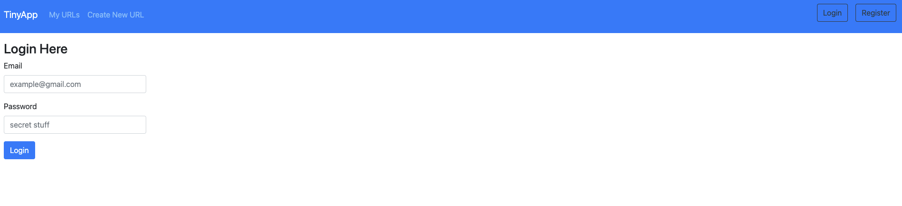

# TinyApp Project

## WELCOME TO MY TINYAPP !

TinyApp is a full stack web application built with Node and Express that allows users to shorten long URLs (à la bit.ly).

## Final Product
#### New User & Existing User Pages
##### To access all of the feature of the TinyApp Project users will need to register or login. Only Registered Users are able to access, edit, and delete their uniquely created list of URLs. Happy browsing :)

## Dependencies

- Node.js
- Express
- EJS
- bcrypt
- body-parser
- cookie-session

## Getting Started

- Install all dependencies (using the `npm install` command).
- Run the development web server using the `node express_server.js` command.